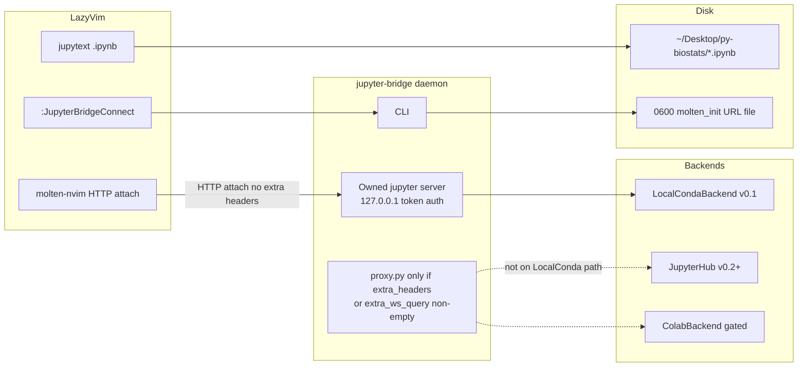

# Jupyter Bridge — Neovim ↔ standard Jupyter kernels (optional Colab backend)

| Field | Value |
| --- | --- |
| **Document** | Product & architecture design |
| **Project name** | **Jupyter Bridge** (CLI / PyPI: `jupyter-bridge`) |
| **Working subtitle** | Optional experimental Google Colab backend behind a localhost Jupyter facade |
| **Author** | Grok / py-biostats |
| **Date** | 2026-09-02 (revised after review) |
| **Status** | Draft |
| **Audience** | Senior engineers; LazyVim / molten users; MSBD520 workflow |
| **Related notes** | `~/Desktop/py-biostats/LAZYVIM_JUPYTER_COLAB.md`, `GROK_OPENCODE_LAZYVIM.md` |
| **Neovim stack** | `~/.config/nvim/lua/plugins/jupyter.lua` (molten-nvim, jupytext.nvim, quarto-nvim) — plugin remains additive |

**Naming:** “Colab” is Google’s trademark. v0.1 is a **generic Jupyter proxy** with a **local conda** backend. Do not publish `colab-bridge` on PyPI until counsel reviews. The nvim commands may stay `:ColabConnect` as aliases of `:JupyterBridgeConnect` only after the Colab spike ships; until then the user-facing command is **`:JupyterBridgeConnect`**. Informal “Colab Bridge” may appear in docs as a *future* backend, not the product tagline.

---

## Overview

Google Colab is a hosted Jupyter runtime with GPUs. Neovim (LazyVim + molten-nvim) is already a notebook editor. Today those worlds only share a **file** (upload/download `.ipynb`). That is not a write/run path.

**v0.1 product:** **Jupyter Bridge** — a CLI + user-level daemon that starts a **local Jupyter Server** (Miniconda) on `127.0.0.1`. molten attaches in **HTTP Jupyter Server mode**. The **exact URL shape and token delivery** (query `?token=`, `Authorization: token`, empty token on loopback, or host:port only) is **not assumed from the README**; it is recorded by a **PR 2 spike** against molten `^1.0.0` + `jupyter-server>=2,<3` (see Kernel attachment). The plugin **must not** `vim.cmd("MoltenInit " .. url)` if the URL contains a secret.

v0.1 **does not** invent a ZMQ↔WS shim. Direct `:MoltenInit python3` is **rollback only**, not the dogfood path.

**Later (gated):** an **experimental Colab backend** that, *if* an official client exports a Jupyter URL + proxy token, injects Colab auth (HTTP headers **and** WebSocket query params) on the daemon side so molten still uses a standard localhost URL. If that export does not exist, Colab stays `blocked` and the project remains useful as a local Jupyter process manager + nvim glue. **Do not market GPU/Colab until the CLI export spike passes.**

Layer 2 (after a vertical slice): JupyterLab as a **full reverse proxy** of a real Jupyter Server (not a REST subset). Chromium is a browser, not a fork.

---

## Background & Motivation

### Current state (this machine)

| Piece | Reality |
| --- | --- |
| Editor | LazyVim; notebooks via jupytext (`.ipynb` as quarto markdown) |
| Execution | molten-nvim `^1.0.0` + quarto-nvim `codeRunner.default_method = "molten"` |
| Keys | `<leader>mi` `:MoltenInit`; `<leader>rc` quarto `run_cell` |
| Python | Miniconda `~/miniconda3`; kernels `python3`, `miniconda`, `nvim-python`; also `~/.local/share/nvim/venv` |
| Project | `~/Desktop/py-biostats` (`hello.ipynb`, lecture PDFs) |
| Existing docs | *“Do not expect molten to talk to a Colab GPU kernel.”* |

Pain: GPU/Colab packages vs local edit loop; file sync; no live kernel. Additive plugin: `lua/plugins/jupyter_bridge.lua` (or copy from `examples/lazyvim/`); **do not edit** `jupyter.lua`.

### Prior art (verified, 2026)

1. **[googlecolab/colab-vscode](https://github.com/googlecolab/colab-vscode)** (Apache-2.0)  
   README (verified): VS Code Jupyter extension, Select Kernel → Colab → Auto Connect, telemetry, Colab ToS. The README does **not** document proxy header names or `*.prod.colab.dev` host patterns. **This design does not treat third-party writeups of `src/colab/client.ts` as our spec.** We do not copy `/tun/m/assign` or vscode-only headers. We **must not** ship Google’s VS Code OAuth client ID or send `X-Colab-Client-Agent: vscode`.

2. **[googlecolab/google-colab-cli](https://github.com/googlecolab/google-colab-cli)** (`colab`) — **only Colab client we will wrap, after a spike**  
   Linux/macOS. Documented commands: `new`, `sessions`, `status`, `restart-kernel`, `stop`, `url`, `exec`, `repl`. `colab url` is a **browser** URL, not a documented Jupyter Server export. There is **no** documented `colab status --json` contract in the README. Session files under `~/.config/colab-cli/` are **private CLI state**, not a public API.  
   In-process kernel attach (source: `src/colab_cli/runtime.py` in that repo, as of public main) uses `jupyter_kernel_client` with:
   - HTTP headers: `X-Colab-Client-Agent: colab-cli`, `X-Colab-Runtime-Proxy-Token: <token>`
   - WebSocket **`extra_params`: `{ "colab-runtime-proxy-token": token }`** (query string on the WS URL; Console/SSH similarly use `?colab-runtime-proxy-token=`)  
   Token refresh internals (e.g. PR #109 `/tun/m/assignments`) are **CLI-internal**, not our API.

3. **[googlecolab/colab-mcp](https://github.com/googlecolab/colab-mcp)** — MCP for a **browser Colab tab** (`notifications/tools/list_changed`). **Out of kernel-attach scope.** Do not wrap for molten.

4. **[googlecolab/jupyter-kernel-client](https://github.com/googlecolab/jupyter-kernel-client)** — HTTP + WS `KernelClient(server_url, token, headers=...)`. Candidate **in-process** Colab path if reverse-proxying `*.prod.colab.dev` is blocked (see Alternatives I).

5. **molten-nvim** attach (answered; not an open question):
   - `:MoltenInit <kernelspec>` → `jupyter_client` ZMQ `KernelManager`
   - `:MoltenInit /path/to/kernel-connection.json` → ZMQ ports in the connection file
   - `:MoltenInit http(s)://…` → Jupyter Server REST + WS (`requests`, `websocket-client`)

6. **Jupyter Server** — local process we start and/or reverse-proxy.

### Why invent (not a workaround)

Copying notebooks is not the long-term product. The **invented** piece is only needed for backends that require **non-standard Jupyter auth** (extra headers + WS query params). v0.1 proves the facade with a **standard** local server so molten HTTP attach and the plugin work. Colab is that invention **if and only if** the spike yields a `JupyterEndpoint`.

---

## Goals & Non-Goals

### Goals (v0.1)

- From nvim in `~/Desktop/py-biostats`: `:JupyterBridgeConnect` → Molten HTTP attach using `molten_init_path` (RPC, not `vim.cmd` with a tokenized URL) → run a cell → molten output.
- Path **must** be **molten → daemon-owned LocalConda Jupyter Server** (no extra proxy hop unless `extra_headers`/`extra_ws_query` are non-empty). Not `:MoltenInit python3`.
- Same `.ipynb` on disk (jupytext unchanged).
- Works **with Google signed out**. Default `--backend local`.
- CLI: `jupyter-bridge auth | up | status | down` (`kernel-spec install` is **not** required for v0.1 HTTP attach).
- Neovim: thin plugin only; do not replace LazyVim; do not edit `jupyter.lua`.

### Goals (post-spike, experimental)

- Colab backend **opt-in** (`--backend colab --i-accept-colab-tos`), status `blocked | needs-official-cli | connected | token-expired`.
- GPU/Colab marketing **only** after the export spike passes.

### Goals (v0.2 / Layer 2)

- Full reverse-proxy of JupyterLab (contents, static `/lab`, terminals as needed).
- Optional Tauri shell later. **Do not fork Chromium.**
- Optional ZMQ↔WS shim **only if** HTTP attach is flaky (spike with pass/fail).

### Non-goals

- Fork Chromium or clone the Colab web UI.
- Replace molten, jupytext, or quarto.
- Ship Google’s VS Code OAuth client ID or impersonate `X-Colab-Client-Agent: vscode`.
- **Unofficial Colab HTTP APIs**, scraping `~/.config/colab-cli/sessions.json` without explicit user consent, or treating CLI-internal REST as our API.
- Guaranteeing GPU quota, account safety, or that Google will accept any third-party client.
- Bidirectional Drive notebook sync (local disk is source of truth).
- Using `colab-mcp` as a kernel.
- **Non-compliant** use of Colab: wrapping the official CLI **does not** waive Colab ToS / Google Privacy Policy.

---

## Proposed Design

### Product name & positioning

**Jupyter Bridge** — a localhost Jupyter facade and nvim glue; **local conda first**. Colab is an optional experimental backend, not the v0.1 identity.

### High-level architecture (v0.1 center = local)



### Sequence: v0.1 connect and run a cell (HTTP only)

```mermaid
sequenceDiagram
  participant U as User (nvim)
  participant P as jupyter_bridge.lua
  participant C as jupyter-bridge CLI
  participant J as 127.0.0.1 Jupyter Server or proxy
  participant K as Local ipykernel
  U->>P: :JupyterBridgeConnect
  P->>C: jupyter-bridge up --backend local --json
  Note over P: async vim.system; do not block UI
  C->>J: start jupyter server 127.0.0.1 token auth
  C->>C: write 0600 molten_init file
  Note over C: health GET /api/kernelspecs only\nno POST /api/kernels
  C-->>P: JSON without raw token; molten_init_path
  P->>U: MoltenInit via Lua API not vim.cmd
  U->>P: leader rc
  P->>J: molten owns POST /api/kernels + WS channels
  J->>K: execute_request
  K-->>J: iopub
  J-->>P: WS frames
  P-->>U: virt text / output win
```

Transports are **not mixed**: molten HTTP mode uses REST+WS only. Connection-file / ZMQ is a **fallback** (`:MoltenInit /path/to/kernel.json` after `jupyter kernel` start), not the v0.1 default.

### Layer 1 — CLI + daemon

**Process model:** `jupyter-bridge serve` / started by `up`:

- One backend instance
- Either **owns** a `jupyter server` on 127.0.0.1 **or** reverse-proxies one
- Kernel map
- State dir: `$XDG_STATE_HOME/jupyter-bridge/` (default `~/.local/state/jupyter-bridge/`; macOS may also use `~/Library/Application Support` only if XDG unset)
- Pidfile with **flock**; refuse concurrent `up` if pid alive; delete stale pid if process gone
- Logs: `$XDG_STATE_HOME/jupyter-bridge/jupyter-bridge.log` (not macOS-only `~/Library/Logs`)
- Crash: next `up` replaces stale pid; no launchd required in v0.1

#### Commands

| Command | Behavior |
| --- | --- |
| `jupyter-bridge auth` | Local: no-op. Colab: delegate to `colab` login **only** after spike + `--i-accept-colab-tos`. |
| `jupyter-bridge up --backend local [--port 0]` | Start server, write molten_init file, print JSON. Default backend **local**. |
| `jupyter-bridge up --backend colab --i-accept-colab-tos ...` | Experimental; fails `blocked` if spike incomplete. |
| `jupyter-bridge status` | Redacted JSON: backend, local_url **without** token query, `molten_init_path`, ttl, experimental flag. |
| `jupyter-bridge down` | Stop daemon/server. Colab `--keep-runtime` only if Colab backend exists. |
| `jupyter-bridge kernel-spec install` | **Not v0.1.** Reserved if ZMQ shim spike passes. |
| `jupyter-bridge lab` | **v0.2.** Full proxy of JupyterLab, not `/api` subset. |

#### JSON contract (`up`)

**Do not print the bearer token.** Print a path:

```json
{
  "ok": true,
  "backend": "local",
  "accelerator": "cpu",
  "local_url_redacted": "http://127.0.0.1:18765",
  "molten_init_path": "/Users/…/.local/state/jupyter-bridge/molten_init",
  "molten_init_kind": "jupyter_server_url",
  "experimental": false,
  "warnings": []
}
```

`molten_init` file (mode `0600`): **shape is an output of the PR 2 molten spike**, not a guessed `?token=` URL. Candidate lines (exactly one format after the spike):

```
http://127.0.0.1:18765/?token=<bridge-token>
http://127.0.0.1:18765
Authorization: token <bridge-token>
```

`status` and nvim `vim.notify` **must not** include the token. Do not store the token in `vim.g.jupyter_bridge` (store `molten_init_path` only). Daemon state JSON stores the token only in the 0600 file, not in world-readable `daemon.json`.

v0.1 JSON **omits `kernel_id`**: molten HTTP init **owns** kernel create/list. Do not pre-create a kernel the plugin cannot pass into MoltenInit.

`molten_init_kind`: `jupyter_server_url` | `connection_file` | `kernelspec`.

### Kernel attachment (molten) — single v0.1 contract

**PR 2 spike (required before freezing `molten_init`):** against stock molten-nvim `^1.0.0` and `jupyter-server>=2,<3` with token auth, record:

1. Whether MoltenInit accepts `http://127.0.0.1:{port}` only, `?token=`, `/tree?token=`, or needs `Authorization: token`.
2. Whether execute works after “connected” (GitHub molten #344: `/tree?token=` connected then failed on execute).
3. Whether token can be supplied without putting it on the ex-command argv (Lua `vim.fn` / molten RPC / env).

**v0.1 attach (mandatory dogfood):** whatever that spike writes into `molten_init`. Until the spike lands, treat `?token=` as a **hypothesis**, not the contract.

**Token vs command history:** the plugin **must not** `vim.cmd("MoltenInit " .. url)` when `url` contains a secret. Prefer molten’s Lua/RPC entry if it exists; else `nvim_cmd` / `cmd.exe` with `output = false` and document residual **cmdline / shada / swap** risk in `docs/LEGAL.md` (SECURITY). `:his` leak is a known residual if only ex-commands work.

**Health:** daemon `health()` = `GET /api/kernelspecs` (and `GET /api/status` if present) **without** `POST /api/kernels`. Molten owns kernel lifecycle on HTTP attach. Optional deeper check: after molten has created a kernel, `status` may list it; do not leave an idle health kernel.

**Rollback:** `:MoltenDeinit` then `:MoltenInit python3` (or `miniconda` / `nvim-python`). This **bypasses** the bridge.

**Fallback if HTTP attach fails (documented, not v0.1 default):** write a Jupyter **connection file** (ZMQ ports of a kernel the daemon started with `jupyter_client`) and `:MoltenInit /path/to/connection.json`.

**ZMQ↔WebSocket shim: v0.2 spike, not the invention of v0.1.** Pass criteria: molten HTTP mode cannot inject cookies/headers we need **and** connection-file attach cannot reach the backend. Fail: HTTP attach works for LocalConda (expected). If a shim is ever built:

- Jupyter **only** substitutes `{connection_file}` (and related placeholders). **`{kernel_id}` is not valid** in `kernel.json`.
- `jupyter_client` writes the connection file and **execs `argv`**; the process must **bind** shell/iopub/stdin/hb/control using that file (HMAC `key` / `signature_scheme` from the file).
- `kernel_id` for upstream WS comes from **daemon state**, not kernelspec JSON.
- Heartbeat: answer ZMQ hb **locally**; do not require upstream hb.
- Do not “write a connection file instead of binding sockets” from `argv`.

**`kernel-spec install` is omitted from v0.1** so engineers cannot ship Mode A kernelspec and call the architecture done.

### Layer 2 — UI

v0.2: run **JupyterLab** as the same `jupyter server` (or reverse-proxy **all** routes: `/lab`, `/static`, `/api/contents`, `/api/terminals`, webpack). CORS `allow_origin` is **v0.2 Lab-only**.

For LocalConda v0.1: molten talks to the **owned Jupyter Server**; **`proxy.py` is not on that path**. Compile and unit-test `proxy.py` in PR 2 against a mock upstream; enable it only when `extra_headers` or `extra_ws_query` are non-empty.

When the proxy is enabled, allowlist at least what molten’s Jupyter HTTP client GETs: **`/api/kernelspecs`**, `/api/kernels`, `/api/sessions`, WS `/api/kernels/{id}/channels` (not a kernels-only subset). Lab remains a full reverse proxy in v0.2.

### Backend interface

```python
from dataclasses import dataclass, field
from typing import Mapping, Protocol

@dataclass(frozen=True)
class JupyterEndpoint:
    url: str
    token: str | None
    extra_headers: Mapping[str, str] = field(default_factory=dict)
    extra_ws_query: Mapping[str, str] = field(default_factory=dict)
    # Colab (from official CLI client, if spike exports it):
    #   extra_headers: X-Colab-Runtime-Proxy-Token, X-Colab-Client-Agent=colab-cli
    #   extra_ws_query: colab-runtime-proxy-token=<token>
    kernel_name_hint: str = "python3"
    experimental: bool = False

class Backend(Protocol):
    name: str
    def auth(self) -> None: ...
    def provision(self, *, accelerator: str | None) -> JupyterEndpoint: ...
    def refresh(self) -> JupyterEndpoint: ...
    def ensure_kernel(self, endpoint: JupyterEndpoint) -> str: ...
    def teardown(self, *, keep_runtime: bool) -> None: ...
    def health(self) -> dict: ...
```

Proxy **must** rewrite WS URLs to append `extra_ws_query` **and** inject `extra_headers` on HTTP and the WS upgrade. Tests assert **both**. Do not invent `X-Colab-Tunnel` / `X-Goog-Colab-Token` unless the **official CLI** sets them on the same code path we wrap; treat those as CLI-internal until then.

#### `LocalCondaBackend` (v0.1 required)

Pin **Jupyter Server 2.x** (major): `jupyter-server>=2,<3` in `pyproject.toml`.

Spawn (illustrative; prefer `jupyter-server` Python API or documented 2.x CLI):

```
jupyter server --port {p} --ip 127.0.0.1 --ServerApp.token={t}
```

- Jupyter Server 2 still accepts `ServerApp.token`; `IdentityProvider.token` is version-sensitive — **detect at runtime** (`jupyter server --help` / try 2.x first) and document the pinned extra.
- **Do not** set `allow_origin` in v0.1 (not `*`, not `http://127.0.0.1:{p}`). Molten is not a browser; CORS does not apply to `requests` / `websocket-client`. Bind **127.0.0.1 only**. Token auth. CORS only when documenting JupyterLab (v0.2). `_xsrf` applies to cookie sessions — molten should use token/`Authorization` per the PR 2 spike.
- `extra_headers={}`, `extra_ws_query={}`.
- Kernel: conda-registered `python3` / `miniconda` / `nvim-python`.

#### `JupyterHubBackend` (after v0.1 vertical slice)

`JUPYTERHUB_URL` + token. Same HTTP attach. May need `Authorization` only.

#### `ColabBackend` (gated; not in v0.1 tagline)

**Spike (must complete before any Colab PR merges):**

1. Install `google-colab-cli` on a throwaway account.
2. Record **documented** stdout of `colab new`, `colab url`, `colab status` (no assumption of `--json`).
3. Inspect whether any **documented** flag exports Jupyter `url` + proxy token + kernel id.
4. **Do not** scrape `~/.config/colab-cli/sessions.json` unless LEGAL.md + CLI prompt: “Jupyter Bridge will read session files created by google-colab-cli. Type yes.” Default is **no**.
5. If URL+token+kernel are not exported: status **`blocked`**; open an upstream issue; **stop**. Product remains local-only.
6. If they are exported: reverse-proxy with headers **and** `colab-runtime-proxy-token` query; agent **`colab-cli` only when using credentials/sessions that CLI created**, never `vscode`.
7. If export is a real Jupyter HTTP URL: **proxy-only** Colab (headers + `extra_ws_query`). If export exists but reverse-proxy to the upstream host fails, **do not** invent a localhost Jupyter facade in PR 6: that **is** the ZMQ↔WS / HTTP-kernel shim. Daemon-side `jupyter_kernel_client` without an upstream Jupyter HTTP server implies **connection-file or shim** attach, which is **out of PR 6 unless PR 5 passed**. Otherwise stay `BackendBlocked` on the proxy-failure path.

`colab-mcp`: out of scope for attach.

### Repo layout

`github.com/<user>/jupyter-bridge`

```
jupyter-bridge/
  README.md
  LICENSE                 # Apache-2.0 (this code only; does not license Colab runtime use)
  NOTICE
  docs/LEGAL.md
  docs/BACKENDS.md
  pyproject.toml          # jupyter-bridge; jupyter-server>=2,<3
  src/jupyter_bridge/
    cli.py
    daemon.py
    proxy.py              # HTTP+WS; header + query inject
    status.py
    backends/base.py
    backends/local_conda.py
    backends/jupyterhub.py
    backends/colab.py     # empty stub raising BackendBlocked until spike
  tests/
  nvim/jupyter-bridge.nvim/
  examples/lazyvim/jupyter_bridge.lua
```

**Layout:** implement the plugin at `nvim/jupyter-bridge.nvim/` (`lua/jupyter_bridge.lua`, `plugin/` optional). `examples/lazyvim/jupyter_bridge.lua` is **only** a lazy.nvim spec (one `return { { ... } }` table). Copy that spec to `~/.config/nvim/lua/plugins/jupyter_bridge.lua`. Point `dir` at the **plugin root**, not at `lua/plugins`. Do **not** add a second `benlubas/molten-nvim` spec (already in `jupyter.lua` with `version = "^1.0.0"` and `build = ":UpdateRemotePlugins"`). Use `dependencies = { "benlubas/molten-nvim" }` only.

#### Neovim plugin sketch (normative for PR 3)

`nvim/jupyter-bridge.nvim/lua/jupyter_bridge.lua` holds `molten_init_from_kind` (60s timeout lives in the spec). `init_from_url` is fictional until the molten spike; fallback `nvim_cmd` may still hit cmdline history (LEGAL residual).

```lua
-- examples/lazyvim/jupyter_bridge.lua  (copy to ~/.config/nvim/lua/plugins/)
local TIMEOUT_MS = 60000

return {
  {
    dir = vim.fn.expand("~/src/jupyter-bridge/nvim/jupyter-bridge.nvim"),
    -- or: "https://github.com/<user>/jupyter-bridge" with subdirectory if split later
    name = "jupyter-bridge.nvim",
    dependencies = { "benlubas/molten-nvim" }, -- do not re-declare molten plugin opts
    cmd = { "JupyterBridgeConnect", "JupyterBridgeDisconnect", "JupyterBridgeStatus" },
    config = function()
      local jb = require("jupyter_bridge")
      vim.api.nvim_create_user_command("JupyterBridgeConnect", function()
        vim.system(
          { "jupyter-bridge", "up", "--backend", "local", "--json" },
          { text = true, timeout = TIMEOUT_MS },
          function(obj)
            vim.schedule(function()
              if obj.code ~= 0 then
                vim.notify((obj.stderr or "") .. (obj.stdout or ""), vim.log.levels.ERROR)
                return
              end
              local info = vim.json.decode(obj.stdout)
              vim.g.jupyter_bridge = { molten_init_path = info.molten_init_path }
              jb.molten_init_from_kind(info.molten_init_kind, info.molten_init_path)
            end)
          end
        )
      end, {})
    end,
  },
}
```

`:checkhealth jupyter_bridge`: warn if molten’s Python lacks `requests` / `websocket-client`. Use `table.unpack` if building argv tables on Lua 5.1. Adjust `dir` to the real clone path; never `stdpath("config") .. "/lua/plugins"`.

---

## API / Interface Changes

| Surface | Change |
| --- | --- |
| CLI | new `jupyter-bridge` |
| nvim | `:JupyterBridgeConnect` / `Disconnect` / `Status`; MoltenInit argument from `molten_init_path` |
| HTTP | v0.1: **daemon-owned full Jupyter Server** (molten talks to it directly). Proxy, **when** `extra_headers`/`extra_ws_query` are set, allowlists `/api/kernelspecs`, `/api/kernels`, `/api/sessions`, WS `/api/kernels/{id}/channels` |

Before: molten → local ipykernel via kernelspec.  
After (v0.1): molten → **HTTP URL** owned by the daemon’s Jupyter Server.

---

## Data Model Changes

State dir `$XDG_STATE_HOME/jupyter-bridge/`:

- `daemon.json` — pid, backend, `local_url_redacted`, `started_at` (**no token**, **no unused kernel_id** in v0.1)
- `molten_init` — 0600 URL or connection path
- `daemon.pid` — flock
- `jupyter-bridge.log`

Secrets: Colab tokens stay in official CLI storage unless user consents to read session files. Bridge token only in `molten_init`. macOS Keychain optional later.

---

## Alternatives Considered

| Alternative | Pros | Cons | Decision |
| --- | --- | --- | --- |
| **A. Teach molten extra HTTP headers** | Direct | Fork molten | Reject as primary |
| **B. Only wrap `colab exec`** | Official | Not interactive molten | Non-interactive extra only |
| **C. SSH into Colab VM** | Familiar | Unofficial, ban history | Reject |
| **D. colab-mcp as kernel** | Official MCP | Wrong abstraction | Out of attach scope |
| **E. Kernel Gateway + ngrok on Colab** | Hobbyist | ToS, tunnels | Reject |
| **F. Localhost Jupyter proxy + Backend Protocol** | Isolates headers; multi-backend | Complexity; Colab may be blocked | **Accept as architecture**; v0.1 may be “daemon-owned jupyter server” with proxy code ready |
| **G. Fork Chromium** | Full UI | Massive | Reject |
| **H. `:MoltenInit http://127.0.0.1` + header/query-injecting proxy, no ZMQ shim** | Matches molten HTTP; cheapest | Needs `requests`/`websocket-client` in molten’s Python | **v0.1 default** |
| **I. Embed `jupyter_kernel_client` in nvim Python host** | Same as official CLI execute path | Extra headers in nvim; no localhost Jupyter | Reject for v0.1. Daemon-side JKC **without** upstream Jupyter HTTP is shim/connection-file (**PR 5**), not a silent PR 6 facade |
| **J. `colab exec` for non-interactive cells** | Official | Not molten outputs | Optional later |

---

## Security & Privacy Considerations

| Threat | Severity | Mitigation |
| --- | --- | --- |
| Trademark / PyPI `colab-*` takedown | Medium | Package **`jupyter-bridge`**; counsel before any Colab branding |
| Unofficial API / fake `vscode` agent | High | No vscode agent; no blog REST; Colab gated |
| Reading another client’s `sessions.json` | High | Forbidden by default; explicit consent prompt + LEGAL.md |
| Token in shell history / `vim.notify` / `vim.g` | Medium | 0600 file; redact status; no notify of URL with token |
| Open proxy / billed GPU | High | 127.0.0.1; token; Colab opt-in flag |
| WS auth missing query param | High | Tests: headers **and** `colab-runtime-proxy-token` query |
| `allow_origin=*` or bogus self-origin | Medium | Omit `allow_origin` in v0.1 |
| Token on `:MoltenInit` argv | Medium | Lua/RPC attach; LEGAL residual cmdline/shada |
| Apache-2.0 on this repo | Info | Does **not** license use of Google Colab runtimes |

**LEGAL.md (required content):** not affiliated with Google; Colab ToS apply when using Colab backend **even if wrapping official CLI**; no session-file scrape without consent; default backend local; experimental Colab requires `--i-accept-colab-tos` (not merely `COLAB_BRIDGE_BACKEND=colab`).

---

## Observability

- Verbose CLI; log file under XDG state (Linux + macOS).
- Events: `provision_ms`, `ws_upgrades`, `header_inject_total`, `ws_query_inject_total`, `upstream_401`.
- Health = `GET /api/kernelspecs` (no extra kernel). Execute_request health is molten’s first cell.
- v0.1 includes local logging (not blocked on Colab PR).
- No 20 ms p99 SLO (unproven; irrelevant for HTTP attach).

---

## Rollout Plan

1. Default `--backend local`.
2. Stage 0: CI LocalConda + molten HTTP contract tests (mock).
3. Stage 1: dogfood `hello.ipynb` via `:JupyterBridgeConnect` HTTP URL.
4. Stage 2: Colab **only if** spike exports endpoint.
5. Rollback: `down` + `:MoltenInit python3`.

Concurrency: second `:JupyterBridgeConnect` errors “already up” (pid lock). Port conflict: `--port 0` then bind retry.

---

## Risks

| Risk | Severity | Mitigation |
| --- | --- | --- |
| molten HTTP missing websocket-client | Medium | Plugin `:checkhealth` / docs; nvim venv pip |
| Colab CLI does not export JupyterEndpoint | High | `blocked`; local product still ships |
| Header-only WS proxy fails Colab | High | Query param + headers. If proxy still fails: **PR 5 shim** or stay `BackendBlocked` — **not** an implicit daemon `jupyter_kernel_client` facade in PR 6 |
| Engineers ship kernelspec-only and skip proxy | Medium | v0.1 has no kernelspec install; dogfood is HTTP |
| Jupyter Server 2 vs 3 CLI flags | Medium | Pin `>=2,<3`; runtime detect |

---

## Open Questions

1. ~~Can molten attach without spawning kernelspec?~~ **Answered:** yes — HTTP URL and connection file.
1b. **Open until PR 2:** exact molten HTTP token/URL shape (`?token=` vs `Authorization` vs loopback empty token) and whether execute works (molten #344).
2. Does `google-colab-cli` export url + proxy token + kernel id on a **supported** interface? **Spike required; until then Colab is blocked.**
3. JupyterLab Contents: always local FS? (v0.2)
4. After spike: default Colab accelerator CPU to save quota?
5. Counsel: is even “Jupyter Bridge + optional Colab backend” OK in README?

---

## Key Decisions

1. **v0.1 product is Jupyter Bridge (local Jupyter facade + nvim glue), not a Colab-branded GPU client.** Rationale: molten HTTP + local server already prove the architecture; Colab may never export an endpoint; trademark risk.
2. **v0.1 attach is molten HTTP Jupyter Server mode; the URL/token string is frozen only after a molten `^1.0.0` spike.** Rationale: README does not document `?token=` parsing; #344 failed on execute. Plugin must not put secrets on `vim.cmd` argv.
2b. **Molten owns HTTP kernel lifecycle; daemon health does not `POST /api/kernels`.** Rationale: avoid leftover kernels and unused `kernel_id` in JSON.
3. **ZMQ↔WS shim is a v0.2 spike, not the invention.** Rationale: mixed transports were wrong; `{kernel_id}` is not a kernelspec placeholder.
4. **Backend `JupyterEndpoint` includes `extra_headers` and `extra_ws_query`.** Rationale: Colab WS auth is not headers-only (`colab-runtime-proxy-token` query), per official CLI `runtime.py`.
5. **Colab is gated on a CLI export spike; no `sessions.json` scrape by default.** Rationale: private CLI state ≠ public API; ToS.
6. **Never send `X-Colab-Client-Agent: vscode`; never ship vscode OAuth client.** Rationale: impersonation.
7. **`colab-mcp` is not a kernel attach path.** Rationale: in-browser MCP.
8. **Thin nvim plugin, async `vim.system`, `molten_init_path` only.** Rationale: provision can take tens of seconds; don’t leak tokens.
9. **Local disk `.ipynb` is source of truth.** Rationale: jupytext/quarto.
10. **Apache-2.0 licenses this repo’s code only.** Rationale: does not grant Colab runtime rights.
11. **Pin Jupyter Server 2.x; 127.0.0.1; token auth; omit `allow_origin` in v0.1.** Rationale: CORS is irrelevant to molten; self-origin CORS breaks `--port 0`.
12. **Dogfood must use the daemon-owned HTTP path, not `:MoltenInit python3`.** Rationale: otherwise Mode A ships without exercising the facade.

---

## References

- molten-nvim `:MoltenInit` (kernelspec | connection file | Jupyter Server URL)
- [googlecolab/google-colab-cli](https://github.com/googlecolab/google-colab-cli) `src/colab_cli/runtime.py` (headers + WS `extra_params`)
- [googlecolab/colab-vscode](https://github.com/googlecolab/colab-vscode) README only (no header spec in this doc)
- [googlecolab/jupyter-kernel-client](https://github.com/googlecolab/jupyter-kernel-client)
- [googlecolab/colab-mcp](https://github.com/googlecolab/colab-mcp) — agent/tab, not attach
- `~/.config/nvim/lua/plugins/jupyter.lua`
- `~/Desktop/py-biostats/LAZYVIM_JUPYTER_COLAB.md`
- Colab Terms of Service / Google Privacy Policy

---

## PR Plan

Each PR is independently reviewable. **Every PR that claims attach names the exact MoltenInit argument.** Colab/Hub/Lab/metrics come **after** a local HTTP vertical slice. Target **~7 PRs**, not a 10-PR split that blocked CLI on a shim.

### PR 1 — Scaffold + LocalCondaBackend (no attach claim)

- **Title:** `feat: jupyter-bridge scaffold and LocalConda Jupyter Server 2.x`
- **Files:** `pyproject.toml` (`jupyter-server>=2,<3`), `backends/base.py` (`extra_ws_query`), `local_conda.py`, `cli.py` (`up --backend local`, `down`, `status` redacted), `docs/LEGAL.md`, `LICENSE`, `NOTICE`
- **Dependencies:** none
- **Description:** Start/stop `jupyter server` on 127.0.0.1 with token, **no `allow_origin`**. Write 0600 `molten_init`. JSON has `molten_init_path`, **no token**, **no kernel_id**. Pidfile flock + XDG state. **MoltenInit argument: none yet** (CLI-only). Rollback remains `:MoltenInit python3`.

### PR 2 — Proxy (header + WS query) + HTTP attach E2E

- **Title:** `feat: HTTP+WS proxy and MoltenInit Jupyter URL E2E`
- **Files:** `proxy.py`, `daemon.py`, `tests/test_proxy_headers.py`, `tests/test_health_execute.py`
- **Dependencies:** PR 1
- **Description:** LocalConda: molten → **owned server** (no proxy hop). Ship `proxy.py` tested against mock upstream; **not** inserted unless extra headers/query. Allowlist includes `/api/kernelspecs`. Health = `GET /api/kernelspecs` only. **Molten HTTP spike:** record exact URL/token mechanism; write that into `molten_init`. Document `requests`/`websocket-client`. **MoltenInit argument:** spike-defined (not assumed `?token=`).

### PR 3 — Neovim plugin (async)

- **Title:** `feat: nvim :JupyterBridgeConnect (async, molten_init_path)`
- **Files:** `nvim/jupyter-bridge.nvim/**`, `examples/lazyvim/jupyter_bridge.lua`
- **Dependencies:** PR 2
- **Description:** Implement the Lua sketch: `vim.system` callback, **60s** timeout, `table.unpack`, `molten_init_kind` switch, **no** `vim.cmd("MoltenInit " .. url)` for tokenized URLs, no token notify, `vim.g` stores path only. checkhealth for websocket-client. **MoltenInit argument:** spike-defined string, invoked via Lua/RPC or `nvim_cmd` without intending history.

### PR 4 — Docs dogfood on py-biostats

- **Title:** `docs: v0.1 path hello.ipynb via HTTP attach`
- **Files:** `README.md`, pointer to `~/Desktop/py-biostats/hello.ipynb`
- **Dependencies:** PR 3
- **Description:** Connect local, run cell in molten. Explicit: this is **not** Colab. **MoltenInit argument:** PR 2 spike string from `molten_init`.

### PR 5 — Optional ZMQ shim spike (may close as wont-implement)

- **Title:** `spike: ZMQ connection-file fallback (optional)`
- **Files:** spike doc + tests; **no** invalid `{kernel_id}` kernelspec
- **Dependencies:** PR 2
- **Description:** Pass/fail: HTTP attach insufficient. If fail (HTTP works), close. If pass, shim binds sockets from jupyter_client connection file; kernel_id from daemon state; local hb; HMAC from connection file. **MoltenInit argument if used:** `/path/to/connection.json`. Does **not** block Colab or nvim.

### PR 6 — Colab spike + stub (merge only if export works)

- **Title:** `feat(experimental): Colab backend or BackendBlocked stub`
- **Files:** `backends/colab.py`, `docs/BACKENDS.md`, mocked tests
- **Dependencies:** PR 2 (proxy) **and** PR 1 (CLI). **Not** PR 5.
- **Description:** Spike checklist. No export → `BackendBlocked` + `--i-accept-colab-tos`. Export of real Jupyter HTTP URL → proxy with `extra_ws_query`. **Do not** implement daemon JKC→localhost Jupyter in this PR (that is PR 5 shim). Proxy-failure without PR 5 → still blocked. **No** default session-file scrape. **MoltenInit argument:** localhost HTTP URL **only if** the facade is the proxy in front of a real upstream Jupyter HTTP API.

### PR 7 — JupyterHub + JupyterLab full proxy + local observability

- **Title:** `feat: Hub backend, Lab full reverse-proxy, structured logs`
- **Files:** `backends/jupyterhub.py`, `lab` command, logging
- **Dependencies:** PR 2, PR 1 (JSON/CLI)
- **Description:** Hub after vertical slice. Lab = **full** reverse proxy (not kernels subset). Logs for **local** happy path (not gated on Colab). **MoltenInit argument:** unchanged HTTP URL.
